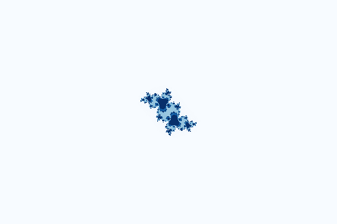

# Fractal_Art

## Julia Set 

To compute a Julia set, put z to the coordinate of the current point and with c a constant.   
Then you'll get a different Julia set for each value of c. ( where there is only a single Mandelbrot set.)

## Computation
J  is the unit matrix with the same dimensions as Z.  
c = -0.143+0.65i  
Z(t+1)=Z(t)∗Z(t)+cJ,

##  Visualization

Scale:  300    

GIF:    

## Sierpinski triangle

#### TODO
